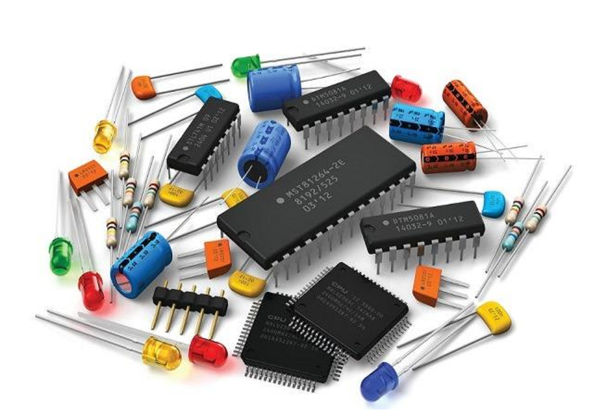

# inventory-electronic-components
Inventory of Electronic Components.

This application offers a solution for inventory management and project planning involving the use of electronic components. It allows for stock control, supplier management, bill of materials tracking, and basic reporting. Its modular design and easy customization make it easily adaptable to other storage-related contexts.

# test gh_pages app... 

 
